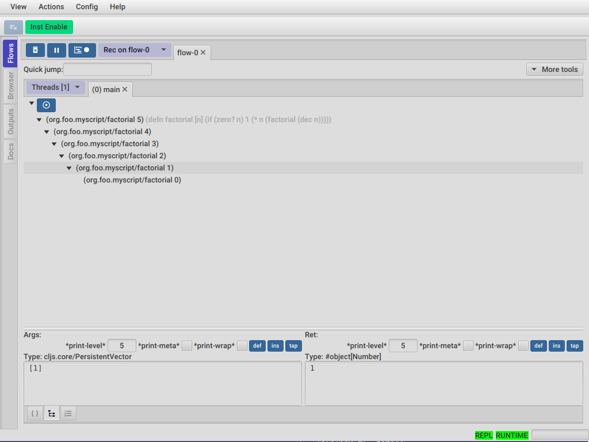
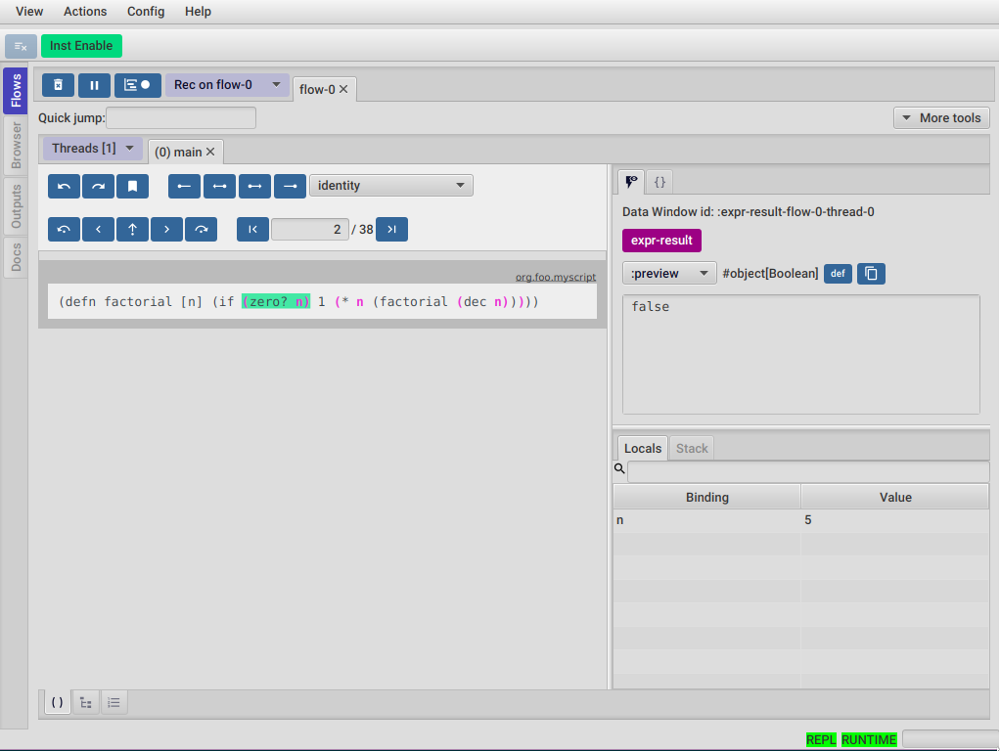

Basic template for trying FlowStorm(https://github.com/jpmonettas/flow-storm-debugger) with shadow-cljs.

## Instructions

- clone this repo, and cd into it
- make sure shadow-cljs.edn contains the latest version of `com.github.jpmonettas/flow-storm-inst`
- run `npm install` to install the packages in package.json
- on one terminal run `npx shadow-cljs watch :dev-test` to watch and compile your code
- open http://localhost:8021
- on another terminal run the debugger `clj -Sforce -Sdeps '{:deps {com.github.flow-storm/flow-storm-dbg {:mvn/version "RELEASE"}}}' -X flow-storm.debugger.main/start-debugger :repl-type :shadow :build-id :dev-test :port 7123`

The debugger UI should show a `main` thread with activity. Check that the bottom right indicators are (REPL and RUNTIME) are turned on (green).
Double click it and you will see the call tree with the factorial function. 
Double click the node and you can step through the function.

This was automatically recorded because the main script loaded by the browser is calling `org.foo.myscript/factorial` function and
our setting in deps.edn are telling the debugger to instrument everything under "org.foo,dev". 

You can open and modify org/foo/myscript.cljs, and every change should be reloaded by shadow and when it runs it should get 
recorded.

If you want to play with recordings at the repl, you can connect a repl to your process with :  ` npx shadow-cljs cljs-repl :dev-test`

Now go to your ClojureScript repl and move to the `dev` ns like `(ns dev)`, and then eval something like `(defn foo [a b] (+ a b))` 
and then call it `(foo 1 2)`

If everything is fine, great! you are successfully running FlowStorm in ClojureScript.

You can now copy the settings from this repo to your own projects and try it there.

Checkout the user guide for documentation on each tool https://jpmonettas.github.io/flow-storm-debugger/user_guide.html

